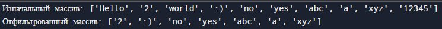
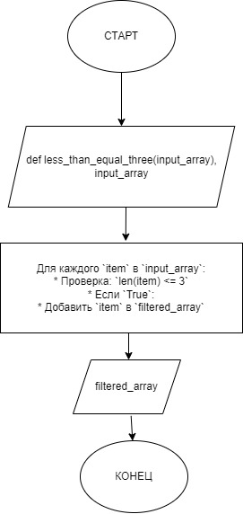

Код программы:
```python
def less_than_equal_three(input_array):
    
    filtered_array = []
    
    for item in input_array:
        if len(item) <= 3:
            filtered_array.append(item)
    
    return filtered_array


original_array = ["Hello", "2", "world", ":)", "no", "yes", "abc", "a", "xyz", "12345"]
result = less_than_equal_three(original_array)

print("Изначальный массив:", original_array)
print("Отфильтрованный массив:", result)
```

Результат вывода в терминал:

> 

Блок-схема алгоритма:
  
> 

Краткое описание блок схемы:

Начало: Старт работы функции.
Инициализация пустого массива: Создаем пустой массив filtered_array.
Перебор элементов входного массива:
Проверка длины строки: Если длина строки <= 3, переходим к шагу 4; иначе пропускаем этот элемент.
Добавление элемента в filtered_array: Если условие на шаге 3 выполнено, добавляем строку в filtered_array.
Повтор шага 3 для следующего элемента: Если все элементы пройдены, переходим к шагу 6.
Возврат filtered_array: Возвращаем отфильтрованный массив.
Конец: Завершение работы функции.
